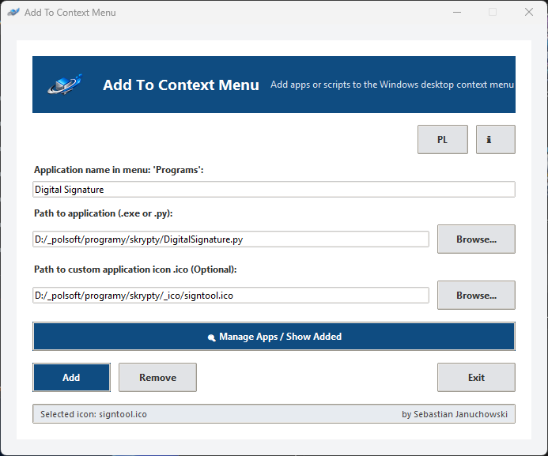

# Add To Context Menu v1.2 🛠️

Add To Context Menu to proste narzędzie dla systemu Windows, które pozwala dodać pliki `.exe` oraz skrypty Python (`.py`) do menu kontekstowego pulpitu.

Wszystkie dodane skróty są umieszczone w dedykowanym podmenu **Programy**.

## 🚀 Funkcje

- **Dodawanie aplikacji i skryptów**: Obsługa uruchamiania plików `.exe` i `.py`.
- **Własne ikony**: Przypisz plik `.ico` do każdego wpisu.
- **Obsługa ikony zastępczej**: Jeśli nie wybierzesz ikony dla skryptu Python, aplikacja wygeneruje domyślną ikonę.
- **Zarządzanie wpisami**: Wbudowane okno do wyświetlania i usuwania dodanych skrótów.
- **Interfejs w dwóch językach**: Przełączaj między polskim i angielskim.
- **Bez uprawnień administratora**: Wpisy zapisują się w rejestrze bieżącego użytkownika (`HKEY_CURRENT_USER`).

## 🛠️ Co nowego w wersji v1.2

- Zaktualizowana nazwa aplikacji i dane pakowania.
- Nowoczesny styl głównego okna.
- Stałe rozmiary okien GUI.
- Obsługa ikony nagłówka z `app_icon.ico`.

## Wymagania

- Windows 10 / 11
- Python 3.6 lub nowszy
- Opcjonalnie: biblioteka Pillow dla lepszej pracy z ikonami

## Uruchamianie

Uruchom aplikację z katalogu projektu:

```bash
python Add_To_Context_Menu.py
```

Jeśli używasz wirtualnego środowiska:

```bash
.venv\Scripts\python.exe Add_To_Context_Menu.py
```

## Jak używać

1. Wpisz nazwę skrótu w polu **Nazwa aplikacji w menu**.
2. Kliknij **Przeglądaj...** i wybierz plik `.exe` lub `.py`.
3. (Opcjonalnie) Wybierz plik `.ico` jako ikonę.
4. Kliknij **Add**.
5. Kliknij prawym przyciskiem myszy na pulpicie i otwórz podmenu **Programy**.

### Usuwanie wpisu

1. Kliknij **🔍 Zarządzaj aplikacjami / Wyświetl dodane**.
2. Wybierz wpis do usunięcia.
3. Kliknij **Usuń zaznaczone**.

## Zrzut ekranu

Przykładowy zrzut ekranu:



## Autor
- Sebastian Januchowski
- Email: polsoft.its@mail.com
- GitHub: [polsoft-seb07uk](https://github.com/polsoft-seb07uk)

## Licencja
Projekt jest udostępniony na licencji MIT. Szczegóły znajdują się w pliku `LICENSE`.
